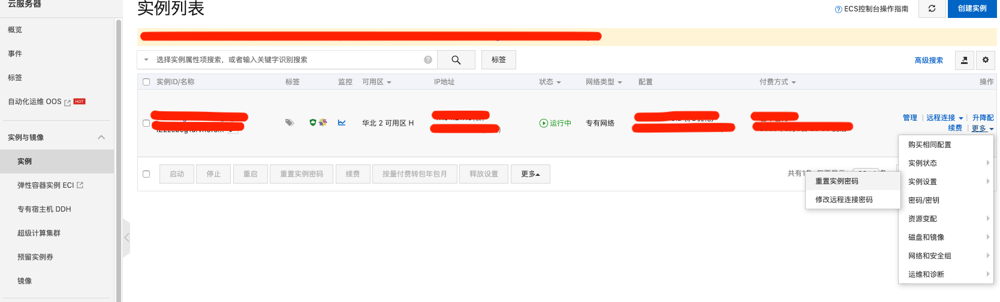
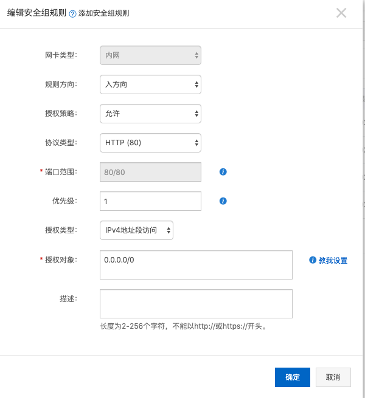
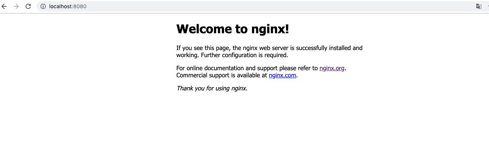

### Nginx基础学习

------

Nginx是一款轻量级的HTTP服务器，采用事件驱动的异步非阻塞处理方式框架，这让其具有极好的IO性能，时常用于服务端的反向代理和负载均衡。

**Nginx的优点**

- 支持海量高并发：采用IO多路复用epoll。官方测试Nginx能够支持5万并发链接，实际生产环境中可以支撑2-4万并发连接数。
- 内存消耗少：在主流的服务器中Nginx目前是内存消耗最小的了，比如我们用Nginx+PHP，在3万并发链接下，开启10个Nginx进程消耗150M内存。
- 免费使用可以商业化：Nginx为开源软件，采用的是2-clause BSD-like协议，可以免费使用，并且可以用于商业。
- 配置文件简单：网络和程序配置通俗易懂，即使非专业运维也能看懂。
- 反向代理功能，负载均衡功能等

#### 第一节、初识Ngnix和环境准备

** 学习环境 **

学习环境你可以有三种选择：

- **自己找个电脑搭建**：需要自己有闲置电脑或者服务器，优点是稳定性高，可控能力强，学习更方便。
- **购买阿里云ECS**：需要花些小钱，1.阿里云学生ECS，每月9.5元 2.注册实名认证后免费一个月的ECS
- **使用虚拟软件**：这个如果电脑配置高，可以安装虚拟软件，缺点是麻烦，影响电脑性能，而且配置也比较多

我选择的是阿里云ECS 操作系统是CentOS 7.6 64位版本

购买ECS后，可以看到实例信息

重置实例密码并重启实例，如图:



```
# ssh root@ip  // 输入密码即可登录远程服务器
```

用yum安装必要的程序

```
yum -y install gcc gcc-c++ autoconf pcre-devel make automake
yum -y install wget httpd-tools vim
```

创建目录

```
mkdir itxing
cd itxing
mkdir app backup download logs work
```

#### 第二节、Ngnix快速搭建

Niginx版本说明 [下载地址](http://nginx.org/en/download.html)

- Mainline version: Mainline 是 Nginx 目前主力在做的版本，可以说是开发版
- Stable version: 最新稳定版，生产环境上建议使用的版本
- Legacy versions：遗留的老版本的稳定版

基于yum方式安装Nginx

查看一下yum是否已经存在

```
yum list | grep nginx
```

系统原来的源只支持1.1版本,版本较低

我们可以自行配置yum源

```
vim /etc/yum.repos.d/nginx.repo
```

复制以下代码，修改文件

```
[nginx]
name=nginx repo
baseurl=http://nginx.org/packages/centos/7/$basearch/
gpgcheck=0
enabled=1
```

安装nginx

```
yum install nginx
nginx -v
```

#### 第三节、Ngnix配置文件

查看nginx安装目录(rpm是linux的rpm包管理工具、-q代表询问模式、-l代表返回列表)

```
rpm -ql nginx
```

##### nginx.conf文件解读

nginx.conf 文件是nginx总配置文件，在搭建服务器时经常调整的文件

进入etc/nginx目录，然后用vim进行打开

```
cd /etc/nginx
vim nginx.conf
```

以下为详细注解

```
#运行用户，默认即是nginx,可以不进行设置
user nginx
#nginx进程，一般设置为和cpu核数一样
worker_processes 1;
#错误日志存放目录
error_log /var/log/nginx/error.log warn;
#进程pid存放位置
pid /var/run/nginx.pid;

events {
  worker_connections 1024; # 单个后台进程的最大并发数
}
http {
  include /etc/nginx/mime.types; #文件扩展名与类型映射表
  default_type  application/octet-stream; #默认文件类型
  #设置日志模式
  log_format main '$remote_addr - $remote_user [$time_local] "$request" '
                  '$status $body_bytes_sent "$http_referer" '
                  '"$http_user_agent" "$http_x_forwarded_for"';
  access_log /var/log/nginx/access.log main; #nginx访问日志存放位置
  sendfile on; #开启高效传输模式
  #tcp_nopush     on;    #减少网络报文段的数量
  keepalive_timeout 65;  #保持链接的时间，也叫超时时间
  #gzip on; #开启gzip压缩
  include /etc/nginx/conf.d/*.conf; #包含的子配置项位置和文件
}
```

##### default.conf配置项讲解

```
cd conf.d
vim default.conf
```

```
server {
  listen 80; #配置监听端口
  server_name localhost; #配置域名
  #charset koi8-r;
  #access_log /var/log/nginx/host.access.log main;
  loaction / {
    root /usr/share/nginx/html; #服务默认启动目录
    index index.html index.htm; #默认访问文件
  }
  #error_page 404 /404.html; #配置404页面
  # redirect server error pages to the static page /50x.html;
  error_page 500 502 503 504 /50x.html; #错误状态码的显示页面，配置后需要重启
  location = /50x.html {
    root /usr/share/nginx/html;
  }
  # proxy the PHP scripts to Apache listening on 127.0.0.1:80
  #
  #location ~ \.php$ {
  #    proxy_pass   http://127.0.0.1;
  #}

  # pass the PHP scripts to FastCGI server listening on 127.0.0.1:9000
  #
  #location ~ \.php$ {
  #    root           html;
  #    fastcgi_pass   127.0.0.1:9000;
  #    fastcgi_index  index.php;
  #    fastcgi_param  SCRIPT_FILENAME  /scripts$fastcgi_script_name;
  #    include        fastcgi_params;
  #}

  # deny access to .htaccess files, if Apache's document root
  # concurs with nginx's one
  #
  #location ~ /\.ht {
  #    deny  all;
  #}
}
```

##### 阿里云的安全组配置

1. 进入阿里云控制台，并找到ECS实例。
2. 点击实例后边的“更多”
3. 点击“网络和安全组” ，再点击“安全组配置”，点击“配置规则”
4. 点击右上角“添加安全组配置”
5. 进行80端口的设置，具体设置如下图



启动nginx

```
nginx
```

浏览http://localhost:8080/   出现以下页面表示你成功了



#### 第四节、Ngnix服务启动、停止、重启

首先通过终端进入服务器

```
ssh root@ip  // 输入密码即可登录远程服务器
```

##### nginx启动

nginx直接启动(执行命令后没反应就是最好的反应)

```
nginx
```

 使用systemctl命令启动

```
systemctl start nginx.service
```

查询服务运行状态

```
ps aux | grep nginx
```

##### nginx停止

```
nginx -s stop
```

```
nginx -s quit
```

```
killall nginx // killall 方法杀死进程
```

```
systemctl stop nginx.service
```

##### 重启nginx

```
systemctl restart nginx.service
```

##### 重新载入配置文件

在重新编写或者修改nginx的配置文件后，需要重新载入

```
nginx -s reload
```

查看端口号

在默认情况下，Nginx启动后会监听80端口，从而提供HTTP访问，如果80端口已经被占用则会启动失败。我么可以使用`netstat -tlnp`命令查看端口号的占用情况

#### 第五节、自定义错误页和访问设置

1.多错误指向一个页面

在/etc/nginx/conf.d/default.conf


http请求出现500 502 503 504任意一个错误的时候都会显示/50x.html

2.单独为错误置顶处理方式


在404.html中写入

```
<html>
  <meta charset="UTF-8">
  <body>
    <h1>404页面没有找到!</h1>
  </body>
</html>
```

3.把错误码换成一个地址


##### 简单实现访问控制

有时候我们的服务器只允许特定主机访问，比如内部OA系统，或者应用的管理后台系统，更或者是某些应用接口，这时候我们就需要控制一些IP访问，我们可以直接在`location`里进行配置

可以在default.conf里配置


#### 第六节、nginx访问权限详讲

##### 上节deny禁止访问 allow允许访问

```
location / {
  root /usr/share/nginx/html;
  index index.html index.html;
  allow 233.88.240.137;
  deny all;
}
```

上面的配置表示只允许`233.88.240.137`进行访问，其他的IP禁止访问。但是如果我们把`deny all`指令，移动到 `allow 233.88.240.137`之前，会发生什么呢？会发现所有的IP都不允许访问了。**这说明了一个问题：就是在同一个块下的两个权限指令，先出现的设置会覆盖后出现的设置（也就是谁先触发，谁起作用）**。

##### 复杂访问控制权限匹配

工作中，访问权限的控制需求更加复杂。对于网站下的img(图片目录)所有用户访问，对于网站下的admin目录则只允许公司内部固定IP访问。

配置代码如下：

```
location =/img{
  allow all;
}
location =/admin{
  deny all;
}
```

`=`代表精确匹配，`=`后是根据其后的模式进行精确匹配。

##### 使用正则表达式设置访问权限

我们要禁止访问所有php的页面，php的页面大多是后台的管理或接口代码，所以为了安全我们经常要禁止所有用户访问，而只开放公司内部访问的

```
location ~\.php$ {
  deny all;
}
```

#### 第七节、nginx设置虚拟主机